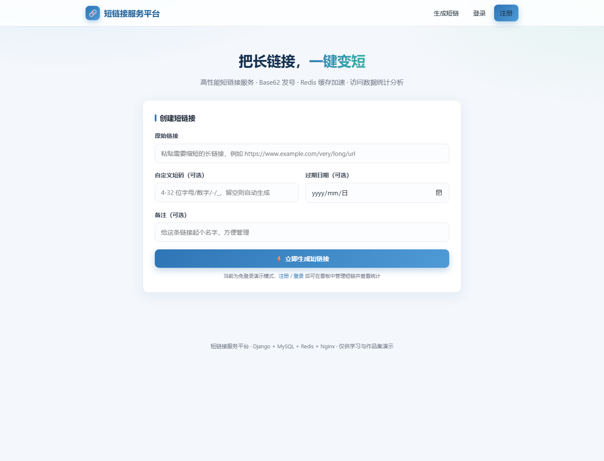

# 短链接服务平台（URL Shortener）

> 一个以「生产可用」为目标设计的高性能短链接服务：基于 **Django + MySQL + Redis + Nginx + Docker** 技术栈，实现短码生成、HTTP 302 重定向、热点缓存、接口限流、PV/UV 数据统计与开放 API，并配套可视化管理看板。


### 🔗 在线体验（Live Demo）

[](https://short-url-gt4s.onrender.com)

部署于 Render 免费实例，**免登录即可创建短链并体验 HTTP 302 跳转与数据看板**。

> ⏳ 免费实例闲置约 15 分钟会休眠，首次打开需冷启动 **30–60 秒**；演示环境使用容器内 SQLite，**重新部署 / 重启后数据会清空**，仅用于功能体验。完整 MySQL + Redis + Nginx 链路请使用下方 Docker Compose 在本地启动。

---

## 📑 目录

- [✨ 功能特性](#功能特性)
- [🖼 界面预览](#界面预览)
- [🏗 技术栈](#技术栈)
- [📐 系统架构](#系统架构)
- [💡 技术亮点与设计思考](#技术亮点与设计思考)
- [📁 项目结构](#项目结构)
- [🗄 数据库设计](#数据库设计)
- [🚀 快速开始](#快速开始)
- [☁️ Render 免费部署](#-render-免费部署)
- [📖 API 文档](#api-文档)
- [🧪 测试](#测试)
- [🔧 配置项](#配置项)
- [🛣 可继续演进的方向](#可继续演进的方向)
- [⚠️ 说明](#说明)
- [📄 License](#license)

---

## ✨ 功能特性

**短链核心**

- 长链接一键缩短，返回 6 位起的短码；支持自定义短链（别名）、备注、过期时间
- 访问短链返回标准 **HTTP 302** 重定向，可随时启用 / 停用 / 删除
- 短码基于自增 ID + Base62 发号，**全局唯一、可逆、不冲突**，并做了防遍历处理

**性能与缓存**

- Redis **Cache-Aside** 缓存热点短链，跳转链路优先命中缓存，降低 MySQL 查询压力
- **空值缓存**防缓存穿透、**TTL 随机抖动**防缓存雪崩、写操作后**主动失效**保证一致性
- Redis 固定窗口**接口限流**，防止短链生成接口被刷
- Redis 宕机时自动降级直查数据库（`IGNORE_EXCEPTIONS`），核心跳转不中断

**数据统计与看板**

- 基于 Redis `INCR` 统计 **PV**、`HyperLogLog` 统计 **UV**（占用内存极小、误差可忽略）
- 记录每次访问的 IP、Referer、设备 / 浏览器 / 操作系统（User-Agent 解析）
- 近 7 天访问趋势、设备与浏览器分布图表（Chart.js），个人短链管理看板

**安全与鉴权**

- 开放 API 使用 `X-API-Key` 鉴权，网页端使用 Session 登录，注册自动签发 API Key
- 目标 URL 做 **SSRF 防护**：拦截指向环回 / 内网 / 链路本地 / 云元数据地址（如 `127.0.0.1`、`169.254.169.254`）的链接
- 访问日志通过后台线程异步落库，不阻塞 302 跳转

**工程化**

- 12-Factor 风格：数据库 / 缓存 / 密钥全部走环境变量，本地 SQLite 零依赖可跑，Docker 一键拉起完整 MySQL + Redis + Nginx 链路
- gunicorn 多 worker + Nginx 反向代理与静态资源托管，分层清晰

---

## 🖼 界面预览



蓝色系简洁界面，支持长链接缩短、自定义短码、过期时间与备注；登录后提供个人短链管理看板，以及基于 Chart.js 的近 7 天访问趋势、设备 / 浏览器分布图表。

---

## 🏗 技术栈

| 层次 | 选型 |
| --- | --- |
| Web 框架 | Python 3.12、Django 5.1（MTV、ORM、Auth、Admin） |
| 数据库 | MySQL 8.0（PyMySQL 驱动，utf8mb4） |
| 缓存 / 统计 | Redis 7（django-redis、String 计数、HyperLogLog） |
| 反向代理 | Nginx 1.27（反代 gunicorn、托管静态资源） |
| WSGI 服务 | gunicorn（多 worker） |
| 前端 | Django Templates、原生 HTML/CSS/JS、Chart.js |
| 部署 | Docker、Docker Compose（多容器编排 + 健康检查 + 数据卷） |

---

## 📐 系统架构

```
                         ┌──────────────────────────────────────────┐
                         │                  浏览器 / API 调用方          │
                         └───────────────────────┬──────────────────┘
                                                  │  HTTP
                                                  ▼
                                       ┌────────────────────┐
                                       │       Nginx         │  :80/:8088
                                       │  静态托管 / 反向代理  │
                                       └──────────┬─────────┘
                                                  │ proxy_pass
                                                  ▼
                                       ┌────────────────────┐
                                       │   Django + gunicorn │  :8000
                                       │  ┌────────────────┐ │
                                       │  │ 短链/跳转/统计API │ │
                                       │  │ 鉴权 / 限流 / 看板 │ │
                                       │  └───────┬────────┘ │
                                       └──────┬───────┬───────┘
                              缓存命中/统计     │       │   持久化/管理
                              ┌────────────────┘       └───────────────┐
                              ▼                                         ▼
                       ┌─────────────┐                          ┌─────────────┐
                       │    Redis 7   │                          │   MySQL 8.0  │
                       │ 热点缓存/限流 │                          │ 短链/日志/用户 │
                       │ PV / UV(HLL) │                          └─────────────┘
                       └─────────────┘
```

**短链跳转请求链路（核心路径）**

1. Nginx 接收请求，注入 `X-Forwarded-For` 等头后反代给 gunicorn；
2. 视图优先查 Redis 缓存（`short:detail:{code}`），命中则直接拿到原始 URL；
3. 未命中查 MySQL，回写缓存（含空值缓存与随机 TTL）；
4. 校验短链是否存在 / 启用 / 过期，返回 **302** 或 404 / 410；
5. 通过后台线程异步记录访问日志与 PV / UV，跳转响应不被写库阻塞。

---

## 💡 技术亮点与设计思考

### 1. Base62 发号：为什么用自增 ID 而不是随机串 / 哈希

- 直接使用数据库自增主键，再转成 Base62（`0-9a-zA-Z`，62 个字符）。相比 8 位随机串，它**绝不冲突、无需查重、写入即得短码**，也比 UUID 更短。
- 对字母表做**固定种子洗牌**，使短码不可被按顺序反推；再叠加一个 `62^5` 的**发号偏移**，让短码从 6 位起步，同时外部无法通过短码长短或连续性推测平台真实数据量、提高遍历成本。
- 短码与 ID 双向可逆，便于内部排查；自定义别名走唯一索引，与系统短码共用一张表。

### 2. Redis 缓存：覆盖缓存三大经典问题

| 问题 | 方案 |
| --- | --- |
| 缓存穿透（查询不存在的短码） | 对"查无此链"也写入**空值标记**，TTL 较短（约 60s） |
| 缓存雪崩（大量 key 同时过期） | 正常缓存 TTL 在 24h 基础上叠加 **0~30 分钟随机抖动** |
| 缓存一致性 | 短链更新 / 删除后**主动删除**对应详情缓存与空值缓存 |

### 3. PV / UV 统计：为什么 UV 用 HyperLogLog

- PV 是可累加计数，用 Redis `INCR`（并按天分 key）即可，天然高并发。
- UV 需要对 IP 去重，若用 Set 存储，访问量越大内存越高。**HyperLogLog** 以固定约 12KB 内存即可统计亿级 UV，标准误差约 0.81%，对短链场景完全可接受；Redis 不可用时回退到数据库 `COUNT(DISTINCT ip)`。

### 4. 跳转性能：异步记录访问

302 跳转是最高频的请求，直接在请求内写访问日志会拖慢响应。项目用守护线程异步落库，并在线程内独立关闭数据库连接，保证跳转路径只做"查缓存 + 302"；该结构后续可平滑替换为 Celery / 消息队列。

### 5. 安全与健壮性

- **双鉴权模型**：开放接口用 API Key（`X-API-Key`），网页用 Session；资源操作严格校验所有者。
- **SSRF 防护**：短链服务端会替用户跳转，若允许指向内网地址可能被用于内网探测，因此对环回 / 私网 / 链路本地 / 云元数据地址做字面量与 DNS 解析双重拦截。
- **限流降级**：生成接口按 IP 固定窗口限流；Redis 故障时缓存层静默降级，不影响主流程。

---

## 📁 项目结构

```
short-url/
├── apps/shortener/
│   ├── models.py             # ShortURL / AccessLog / APIKey 三张表
│   ├── views.py              # 网页视图 + RESTful API + 302 跳转
│   ├── urls.py / admin.py / forms.py / signals.py
│   ├── migrations/
│   └── services/             # 业务逻辑分层（瘦视图，胖服务）
│       ├── base62.py            # Base62 发号（洗牌字母表 + 偏移）
│       ├── short_url_service.py # 短链创建 / 更新 / 删除（事务）
│       ├── cache_service.py     # 热点缓存 / 空值缓存 / 主动失效
│       ├── rate_limit.py        # Redis 固定窗口限流
│       ├── url_validator.py     # URL 规范化 + SSRF 防护
│       ├── auth_service.py      # API Key / Session 双鉴权
│       ├── stats.py             # PV / UV / 趋势 / 设备分布
│       └── recorder.py          # 访问日志异步落库
├── config/                   # Django 工程配置（settings/urls/wsgi/asgi）
├── templates/                # 首页 / 看板 / 统计详情 / 登录注册 / 错误页
├── static/css/               # 前端样式
├── nginx/nginx.conf          # Nginx 反向代理与静态托管
├── docker/entrypoint.sh      # 等待 DB → migrate → collectstatic → gunicorn
├── scripts/                  # 冒烟测试与端到端测试
├── Dockerfile
├── docker-compose.yml        # Nginx + Web + MySQL + Redis 一键编排
├── requirements.txt
└── .env.example
```

---

## 🗄 数据库设计（MySQL）

**`short_url`（短链）**

| 字段 | 类型 | 说明 |
| --- | --- | --- |
| id | BIGINT AUTO_INCREMENT | 主键，同时作为 Base62 发号源 |
| code | VARCHAR(32), UNIQUE | 系统短码 |
| alias | VARCHAR(32), UNIQUE, NULL | 自定义短链 |
| original_url | VARCHAR(2048) | 原始长链接 |
| creator_id | FK→auth_user, SET NULL | 创建者（匿名可为空） |
| remarks | VARCHAR(255) | 备注 |
| is_active | BOOLEAN | 启用 / 停用 |
| expires_at | DATETIME, NULL | 过期时间（空为永不过期） |
| created_at | DATETIME | 创建时间 |

索引：`(creator_id, created_at)`。

**`access_log`（访问日志）**：`short_url_id`(FK)、`ip`、`user_agent`、`device_type`、`browser`、`os_name`、`referer`、`accessed_at`；索引 `(short_url_id, accessed_at)`、`(accessed_at)`。

**`api_key`（接口密钥）**：`key`(UNIQUE)、`user_id`(OneToOne)、`is_active`、`created_at`，注册用户时通过 signal 自动签发。

---

## 🚀 快速开始

### 方式一：Docker Compose 一键启动（推荐，完整链路）

需安装 Docker 与 Docker Compose。

```bash
# 1. 构建并后台启动 Nginx + Web(gunicorn) + MySQL + Redis
docker compose up -d --build

# 2. 打开浏览器
#    前台页面 / 生成短链：  http://localhost:8088
#    Django 管理后台：      http://localhost:8088/admin （先创建管理员，见下）
```

首次启动会自动完成 MySQL 建库迁移与静态文件收集。常用命令：

```bash
docker compose ps                 # 查看容器状态
docker compose logs -f web        # 查看 Web 日志
docker compose exec web python manage.py createsuperuser   # 创建管理员
docker compose down               # 停止
docker compose down -v            # 停止并清空数据卷（重置数据）
```

> 默认宿主机端口为 **8088**，如被占用可设置环境变量 `HTTP_PORT=xxxx` 后再启动。

### 方式二：本地零依赖启动（SQLite + 进程内缓存）

无需安装 MySQL / Redis，便于快速阅读与调试代码。

```bash
python -m venv .venv
# Windows
.venv\Scripts\activate
# macOS / Linux
source .venv/bin/activate

pip install -r requirements.txt
python manage.py migrate
python manage.py runserver        # http://127.0.0.1:8000
```

若本机已有 MySQL / Redis，复制 `.env.example` 为 `.env`，设置 `DB_ENGINE=mysql` 与 `REDIS_URL=redis://127.0.0.1:6379/0` 即可切换到完整链路。

---

## ☁️ Render 免费部署

仓库已适配 Render 等免 Nginx 的 PaaS：容器启动时自动执行 `migrate`、用 **WhiteNoise** 托管静态文件、gunicorn 绑定 Render 注入的 `$PORT`；不配置 MySQL / Redis 时自动回退 **SQLite + 进程内缓存**，零外部依赖即可上线。

1. 将本仓库推送到你的 GitHub（公有仓库可直接用 Render 的 **Public Git Repository** 连接，无需安装 Render GitHub App）。
2. Render 控制台 **New → Web Service**，Runtime 保持自动检测到的 **Docker**（根目录自带 `Dockerfile`），分支选 `main`，实例类型选 **Free**。
3. 添加以下环境变量（最小集合）：

| 变量 | 值 |
| --- | --- |
| `DB_ENGINE` | `sqlite`（使用容器内 SQLite，不连 MySQL） |
| `DJANGO_SECRET_KEY` | 随机长字符串 |
| `DJANGO_DEBUG` | `False` |
| `DJANGO_ALLOWED_HOSTS` | `*` |
| `ALLOW_ANONYMOUS_CREATE` | `True`（开启免登录演示） |
| `CSRF_TRUSTED_ORIGINS` | `https://<服务名>.onrender.com` |
| `SITE_BASE_URL` | `https://<服务名>.onrender.com` |

4. 部署完成后访问 Render 分配的域名即可。**注意**：Render 会在服务名后追加随机后缀（如 `short-url-ab12`），务必把 `CSRF_TRUSTED_ORIGINS` 与 `SITE_BASE_URL` 改成浏览器地址栏里的**完整实际域名**后再次保存触发部署，否则网页表单 POST 会报 CSRF 403、生成的短链域名也会不正确。

> 📌 **免费实例限制（务必知悉）**：约 15 分钟无访问自动休眠，冷启动需 **30–60 秒**；SQLite 位于临时磁盘，**重新部署 / 重启后数据清空**，仅适合功能演示。需要持久化可挂载 Render Disk（并让 SQLite 指向挂载目录），或改用 Render 免费 PostgreSQL + Upstash Redis（在 `config/settings.py` 中补充对应后端即可）。

---

## 📖 API 文档

所有接口返回统一 JSON：`{ "code": 200, "message": "...", "data": ... }`。

| 方法 | 路径 | 鉴权 | 说明 |
| --- | --- | --- | --- |
| GET | `/api/health` | 无 | 健康检查 |
| POST | `/api/shorten` | 可选 | 创建短链（未鉴权时受匿名开关与限流控制） |
| GET | `/api/links` | 需要 | 获取当前用户的全部短链 |
| GET | `/api/links/{code}` | 所有者 | 获取短链统计（PV/UV/趋势/分布） |
| PATCH | `/api/links/{code}` | 所有者 | 更新启用状态 / 过期时间 |
| DELETE | `/api/links/{code}` | 所有者 | 删除短链及其访问日志 |
| GET | `/{code}` | 无 | **302 重定向**到原始链接 |

**创建短链**

```bash
curl -X POST http://localhost:8088/api/shorten \
  -H "Content-Type: application/json" \
  -d '{"original_url":"https://docs.djangoproject.com/"}'
```

带鉴权与自定义别名：

```bash
curl -X POST http://localhost:8088/api/shorten \
  -H "Content-Type: application/json" \
  -H "X-API-Key: sk_你的APIKey" \
  -d '{"original_url":"https://www.djangoproject.com/","alias":"django","remarks":"官方文档"}'
```

响应示例：

```json
{
  "code": 201,
  "message": "created",
  "data": {
    "code": "aZ3kP9",
    "short_url": "http://localhost:8088/aZ3kP9",
    "original_url": "https://docs.djangoproject.com/",
    "expires_at": null
  }
}
```

**访问短链（302）**

```bash
curl -i http://localhost:8088/aZ3kP9
# HTTP/1.1 302 Found
# Location: https://docs.djangoproject.com/
```

**停用 / 删除短链**

```bash
curl -X PATCH  http://localhost:8088/api/links/aZ3kP9 -H "X-API-Key: sk_xxx" \
  -H "Content-Type: application/json" -d '{"is_active": false}'
curl -X DELETE http://localhost:8088/api/links/aZ3kP9 -H "X-API-Key: sk_xxx"
```

---

## 🧪 测试

| 脚本 | 说明 |
| --- | --- |
| `scripts/dev_smoke.py` | 基于 Django test client，**无需启动服务**，验证发号、创建、302、SSRF、统计等核心逻辑 |
| `scripts/http_e2e.py` | 真实 HTTP 端到端测试（25 项检查），覆盖鉴权、限流拦截、PV/UV、启停删除等，需要先启动服务 |

```bash
# 逻辑冒烟（SQLite / LocMem）
python scripts/dev_smoke.py

# 对运行中的服务做端到端测试（默认本地 8090，可用 BASE_URL 切换）
$env:BASE_URL="http://localhost:8088"   # Windows PowerShell
# export BASE_URL=http://localhost:8088  # macOS / Linux
python scripts/http_e2e.py
```

---

## 🔧 配置项（环境变量）

| 变量 | 默认值 | 说明 |
| --- | --- | --- |
| `DJANGO_SECRET_KEY` | 内置开发值 | 生产务必替换为随机长字符串 |
| `DJANGO_DEBUG` | `True` | 生产置 `False` |
| `DJANGO_ALLOWED_HOSTS` | `*` | 允许的域名，逗号分隔 |
| `CSRF_TRUSTED_ORIGINS` | localhost:8000/8088/8090 | CSRF 可信来源（反代 / 自定义域名时按实际地址配置） |
| `DB_ENGINE` | 空（SQLite） | 设为 `mysql` 启用 MySQL |
| `DB_HOST/PORT/NAME/USER/PASSWORD` | — | MySQL 连接信息 |
| `REDIS_URL` | 空（LocMem） | 如 `redis://cache:6379/0` |
| `SITE_BASE_URL` | `http://localhost:8000` | 拼接短链用的对外地址 |
| `SHORT_CODE_MIN_LENGTH` | `6` | 系统短码最小位数（发号偏移 62^(N-1)） |
| `ALLOW_ANONYMOUS_CREATE` | `True` | 是否允许匿名创建 |
| `RATE_LIMIT_WINDOW / RATE_LIMIT_MAX` | `60 / 30` | 限流窗口（秒）与上限 |
| `HTTP_PORT` | `8088` | 仅 Docker Compose，宿主机映射端口 |

---

## 🛣 可继续演进的方向

- 引入 **布隆过滤器（Bloom Filter）**，在缓存前再挡一层不存在的短码；
- 发号升级为**号段模式 / 雪花算法**，配合分库分表支撑更高并发与容量；
- 访问日志异步化从守护线程升级为 **Celery + 消息队列**；
- 增加**多级缓存**（进程内本地缓存 + Redis）与热点 key 预热；
- 接入 **Prometheus + Grafana**，暴露 QPS、缓存命中率、302 延迟等指标；
- 短链批量生成、访问二维码、地域 / 时段分析，以及单元测试覆盖率与 CI/CD 流水线。

---

## ⚠️ 说明

本项目用于个人作品集与技术学习，默认密码 / 密钥仅为本地演示用途，**请勿直接用于生产**；上线前请替换密钥、收紧 `ALLOWED_HOSTS`、关闭 DEBUG，并按需配置 HTTPS。

## 📄 License

[MIT](LICENSE)
